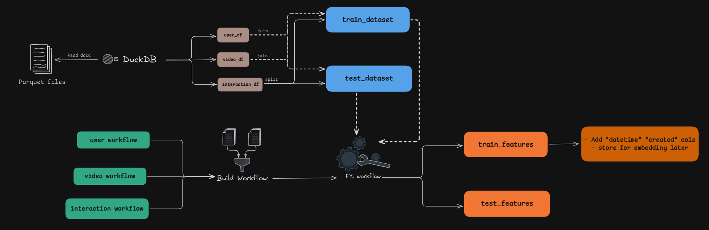

# Rectik - Recommendation System for TikTok
> Rectik is a recommendation system project aimed at building, training, and deploying a multi-stage recommendation system for TikTok-style short videos. This project utilizes the NVIDIA Merlin ecosystem for efficient data processing, feature extraction, and model deployment, while leveraging Metaflow for workflow management.

---

## Project Structure
Rectik’s workflow is divided into three main flows:

1. __Data Flow__: Handles data preprocessing, feature extraction, and transformations.
2. __Train Flow__: Defines and trains the recommendation models, including retrieval and reranking stages.
3. __Serve Flow__: Combines models from the train flow to create an ensemble for deployment.

### 1. Data Flow
The Data Flow pipeline is responsible for:

- __Data Preprocessing__: Preparing raw data for modeling, including handling missing values, feature engineering, and data transformations.
- __Feature Extraction__: Extracting video features to serve as input for downstream models.
- __Data Splitting__: Splitting the data into training and testing sets.
These steps ensure that the data is compatible with NVIDIA Merlin models.

### 2. Train Flow
The Train Flow pipeline defines and trains models for the recommendation system using a multi-stage approach:

__Retrieval (Two-Tower Model)__: This model retrieves a large set of candidate videos, narrowing down potential recommendations to a manageable number.
__Reranking (DLRM)__: This model ranks the retrieved candidates to find the most relevant videos.
Tools Used:
__NVIDIA Merlin__: For model building and training.
__FAISS__: For vector similarity search, used to speed up the retrieval of candidates.
__Feast__: As a feature store for managing and serving user and item features.

### 3. Serve Flow
The Serve Flow pipeline handles the following tasks:

__Ensemble Creation__: Merging the retrieval and reranking models into a single ensemble.
__Deployment Setup__: Preparing the model repository with metadata, workflows, and checkpoints for deployment on Triton Server for efficient inference.

## Technology Stack
- Data Processing:
    - NVIDIA Merlin Ecosystem for end-to-end recommendation workflows.
    - Pyarrow, Cudf, Dask for fast data manipulation.
    - DuckDB for SQL-based operations on Parquet files.
- Vector Store: FAISS
- Feature Store: Feast
- Model Deployment: Triton Server Inference for efficient inference of model ensembles.

